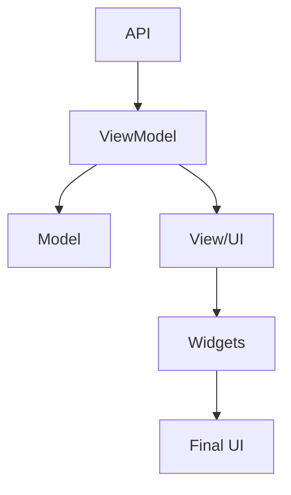

<<<<<<< HEAD
# Portfolio Website - Flutter Web


A professional portfolio website built with Flutter Web technology. Features responsive design, modern animations, and modular architecture.

## 🚀 About The Project

This project is based on MVVM (Model-View-ViewModel) architecture and uses Provider for state management. The project meets all modern UI/UX standards and provides dynamic content loading through API integration.

## 📱 Project Demo


## 🛠️ Technologies

- **Flutter Web:** Cross-platform web development
- **Provider:** State management
- **Animations:** Modern animations (Fade, Slide, Transform)
- **HTTP:** For API communication
- **Responsive Design:** Optimized for all screen sizes

## 🏗️ Architecture

The project follows MVVM (Model-View-ViewModel) architecture:

```
lib/
├── main.dart                      # Project entry point
├── models/                        # Data models
│   ├── skill_model.dart           # Skill model
│   ├── project_model.dart         # Project model
│   ├── service_model.dart         # Service model
│   ├── blog_model.dart            # Blog model
│   ├── contact_model.dart         # Contact model
├── viewmodels/                    # ViewModels
│   ├── home_viewmodel.dart        # Home page ViewModel
│   ├── about_viewmodel.dart       # About page ViewModel
│   ├── portfolio_viewmodel.dart   # Portfolio ViewModel
│   ├── services_viewmodel.dart    # Services ViewModel
│   ├── blog_viewmodel.dart        # Blog ViewModel
│   ├── contact_viewmodel.dart     # Contact ViewModel
├── pages/                         # Pages
│   ├── home_page.dart             # Home page
│   ├── about_page.dart            # About page
│   ├── portfolio_page.dart        # Portfolio page
│   ├── services_page.dart         # Services page
│   ├── blog_page.dart             # Blog page
│   ├── contact_page.dart          # Contact page
├── widgets/                       # Reusable components
│   ├── section_title.dart         # Section title component
│   ├── nav_item.dart              # Navigation item
│   ├── social_button.dart         # Social media buttons
│   ├── skills_list.dart           # Skills list
│   ├── experience_card.dart       # Experience card
│   ├── contact_info.dart          # Contact information
│   ├── contact_form.dart          # Contact form
├── providers/                     # State management
│   ├── team_provider.dart         # Team provider
```

## 📊 Data Flow



## 🌟 Key Features

- **Responsive Design:** Adaptive layout for all devices
- **Dynamic Content:** Loading data dynamically through API
- **Smooth Animations:** Modern animations for enhanced user experience
- **Modular Architecture:** Easy-to-understand and expandable code structure
- **Clean Code:** Well-organized and readable codebase
- **Portfolio Showcase:** Professional display of projects and skills

## 📋 Pages

- **Home:** Introduction and key information
- **About:** Experience, skills, and team members
- **Portfolio:** Showcase of projects
- **Services:** Services offered
- **Blog:** Articles and news
- **Contact:** Contact information and form

## 💻 Getting Started

```bash
# Clone the repository
git clone https://github.com/username/portfolio-website.git

# Install dependencies
flutter pub get

# Run the project
flutter run -d chrome
```

## 🧪 Future Plans

- [ ] Dark mode implementation
- [ ] Multi-language support
- [ ] Firebase integration
- [ ] Admin panel
- [ ] SEO optimization

## 📘 Additional Documentation

- [Figma Design](https://figma.com/url-to-design)
- [API Documentation](https://api-docs-url)

## 📝 License

MIT License - [LICENSE](LICENSE)

## 👨‍💻 Author

Created by: [Your Name](https://github.com/username)

---

⭐️ If you like this project, don't forget to give it a star on GitHub! ⭐️
=======
# me_partfolio

A new Flutter project.

## Getting Started

This project is a starting point for a Flutter application.

A few resources to get you started if this is your first Flutter project:

- [Lab: Write your first Flutter app](https://docs.flutter.dev/get-started/codelab)
- [Cookbook: Useful Flutter samples](https://docs.flutter.dev/cookbook)

For help getting started with Flutter development, view the
[online documentation](https://docs.flutter.dev/), which offers tutorials,
samples, guidance on mobile development, and a full API reference.
>>>>>>> 0354971 (Birinchi yuklash)
